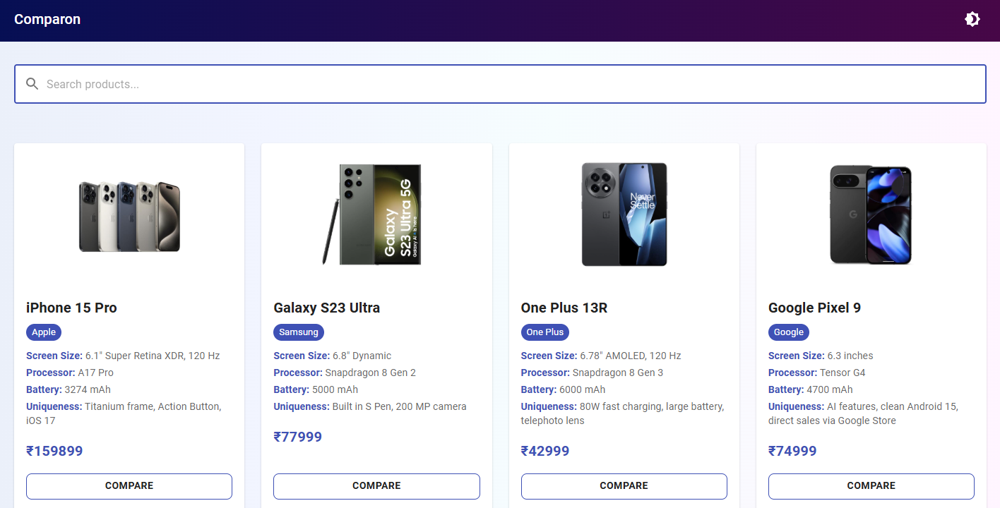

# Comparon - Product Comparison Tool



## Features
- Compare up to 3 products side-by-side
- Responsive design (mobile & desktop)
- Dark/light mode toggle
- Local storage persistence
- Search functionality
- Visual difference highlighting

## Setup Instructions

1. Clone the repository:
```bash
git clone https://github.com/csenaren/comparon.git
cd comparon
```

2. Install dependencies:
```bash
npm install
```

3. Run the development server:
```bash
npm start
```

4. For production build:
```bash
npm run build
```

## Assumptions
- Uses static product data (no backend)
- Tested on modern browsers (Chrome, Firefox, Safari)
- Images should be placed in `src/images/` folder

## Live Demo
**👉 [View Live on Vercel](https://comparon-git-main-csenaren-gmailcoms-projects.vercel.app/)**
